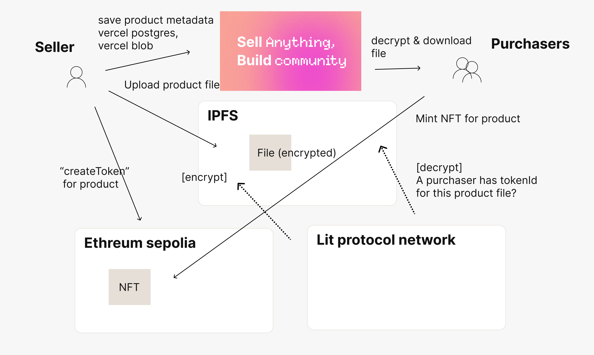

# DRIP3

Sell anything (texts, music, pictures, etc.) and Build communities with purchasers.

We aimed to create a crypto version of Gumroad. We upload files to IPFS, but they are encrypted using Lit Protocol, so only NFT purchasers can decrypt them.
Additionally, purchasers can subscribe via web3inbox and receive updates from the creator.

- Sigin in with web3modal v3
- Upload product
  - Upload data to IPFS(web3.storage) with lit encryption
  - Set title, thumbnail image, description, price (meta data is stored vercel postgres)
  - Generate product's url with uploaded file cid `https://drip3.cc/[:cid]`
  - Purchasers can buy products by minting NFT
- Only purchasers can decrypt the uploaded file
- Purchasers can subscribe feature update with web3inbox

## Frontend

- Next.js
- tailwind.css

## Contract

- sepolia: https://sepolia.etherscan.io/address/0xC36dcDfF4968a80a91015A55fF07426E0e9F8658
